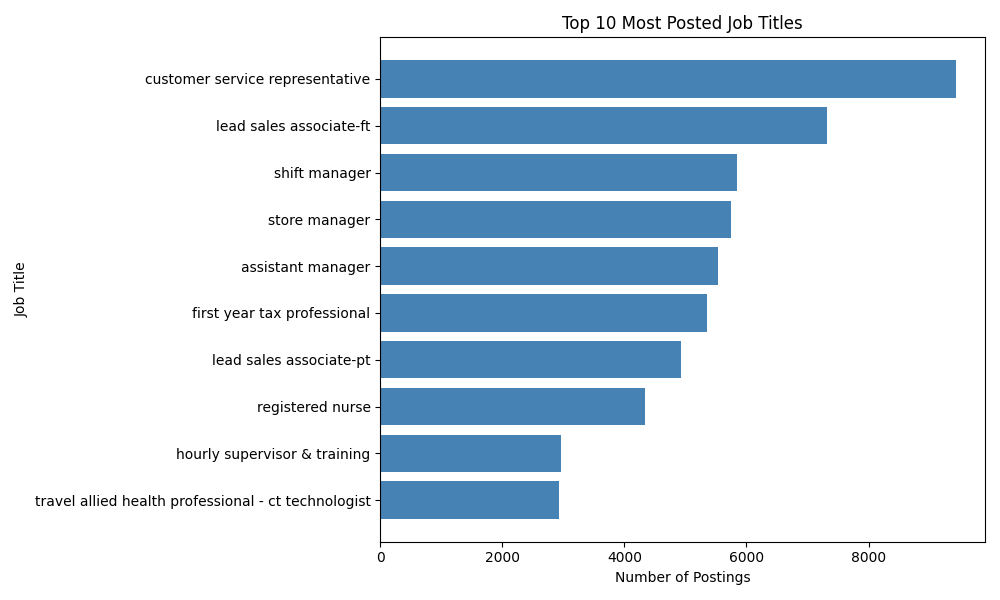
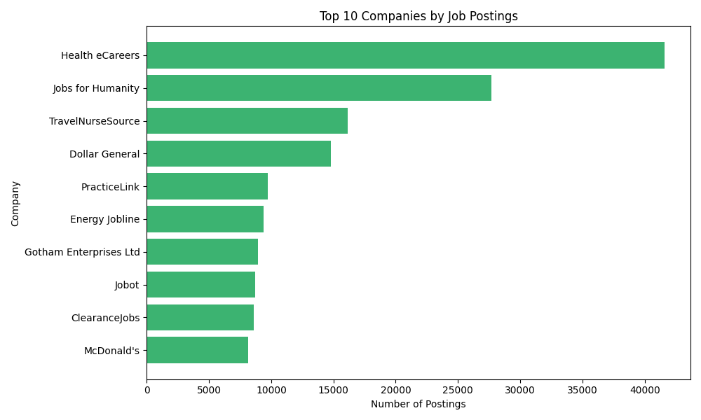
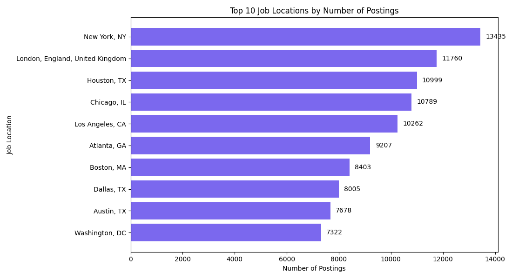
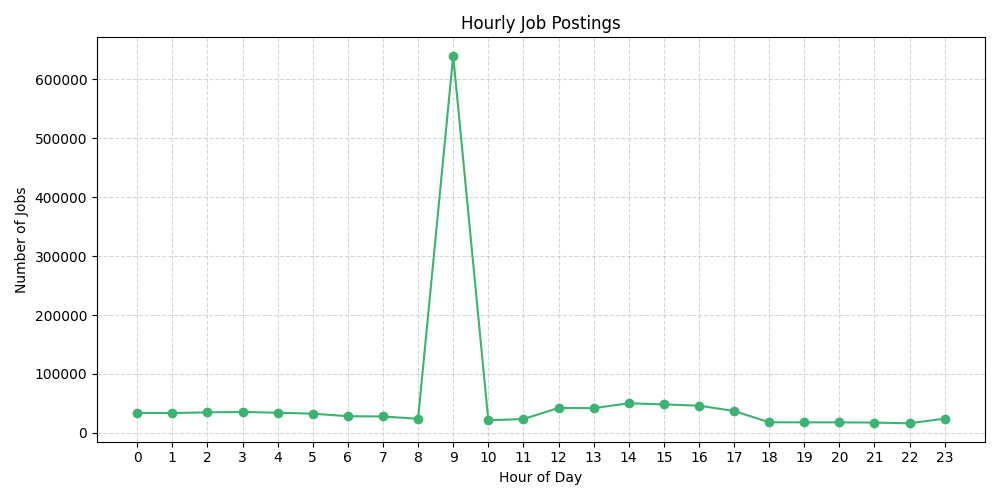
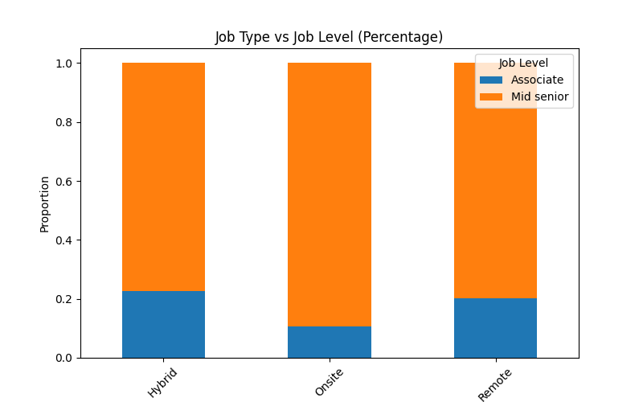
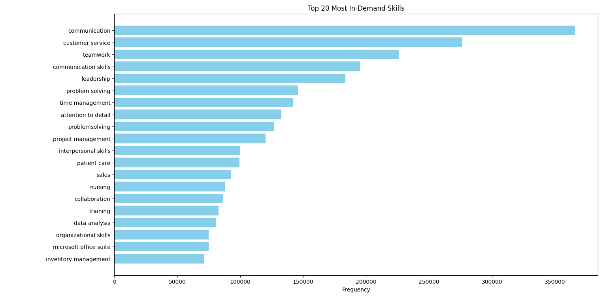
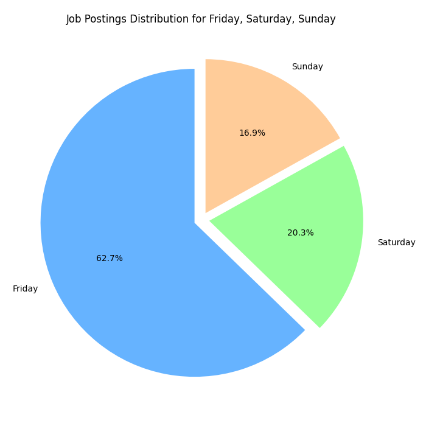

# 📊 LinkedIn Job Market Analysis using Python (EDA)

🚀 Analyzed LinkedIn job postings data to uncover hiring trends, in-demand skills, and job market patterns using Python.

---

## 📌 Overview
This project analyzes LinkedIn job postings data to derive actionable insights into hiring trends, skill demand, and job distribution patterns.

### The idea is simple:
- What kind of jobs are most common?
- When are they posted?
- What skills are companies really looking for?

---

## 📁 Dataset

### Files Included
1. **linkedin_job_postings.csv**
   Contains job-related information:
   - job_link  
   - last_processed_time  
   - job_title  
   - company  
   - job_location  
   - first_seen  
   - search_city  
   - search_country  
   - search_position  
   - job_level  
   - job_type  

2. **job_skills.csv**
   Contains job-skill mapping:
   - job_link  
   - job_skills  

⚠️ Due to GitHub file size limitations, only a sample dataset is included.  
Full dataset available here: https://shorturl.at/xxEGM
---

## ⚙️ Tech Stack
- Python 3.x  
- Pandas  
- NumPy  
- Matplotlib  
- Jupyter Notebook  

---

## 🔍 Key Steps in EDA

### 1. Data Inspection
- Checked dataset structure, data types, and summary  
- Identified null values and duplicates  

### 2. Feature Engineering
- Extracted:
  - Hour  
  - Day  
  - Month  
  - Day of Week  
- Standardized job titles and skills to lowercase  

---

## 📊 Visualizations

### 1. Top 10 Job Titles
- Horizontal bar chart showing most frequent roles  


### 2. Top 10 Companies
- Identifies top hiring organizations  


### 3. Top 10 Job Locations
- Shows cities with highest job postings  


### 4. Hourly Job Posting Trends
- Line chart showing peak posting hours  


### 5. Job Type vs Job Level
- Stacked bar chart for distribution  


### 6. Top 20 Job Skills
- Most in-demand skills across postings  


### 7. Day-of-Week Distribution
- Pie chart showing posting distribution  


---

## 💡 Key Insights
1. Job postings are heavily concentrated in service and sales roles  
2. Hiring activity is higher in urban locations  
3. Job postings peak around 9 AM, indicating early recruiter activity  
4. Most postings occur on Fridays and weekends  
5. Mid-level roles dominate the job market  
6. Soft skills like communication and teamwork are highly demanded  

---

## 📈 Business Impact
- Helps job seekers target high-demand roles and optimize application timing  
- Assists recruiters in understanding hiring trends and skill demand  
- Supports workforce planning and talent acquisition strategies  

---

## 🎯 Conclusion
This analysis highlights that:
- The job market is driven by service-oriented roles  
- Timing plays a crucial role in job applications  
- Employers prioritize experience and soft skills  
- Opportunities are concentrated in urban locations  

These insights help job seekers make data-driven decisions and improve their job search strategy.

---

## 📂 Project Structure
```bash
data/
images/
linkedin_job_eda.py
README.md
requirements.txt
```

---

## 🚀 How to Run
```bash
git clone https://github.com/Saqeeb-Pathan/linkedin-job-eda
cd linkedin-job-eda
pip install -r requirements.txt
python linkedin_job_eda.py
```
